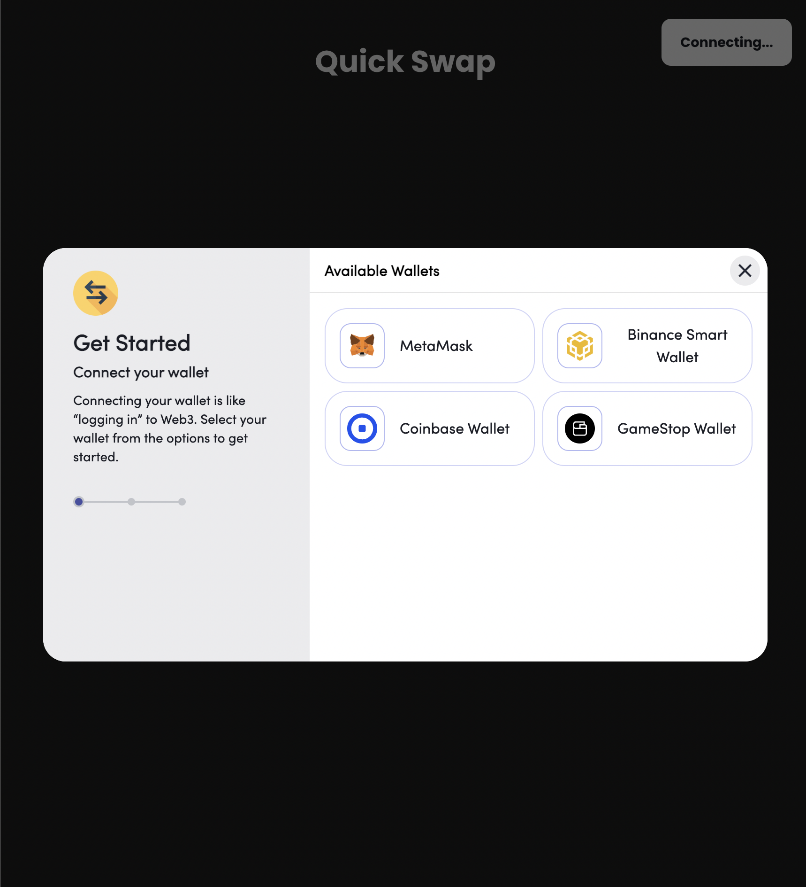
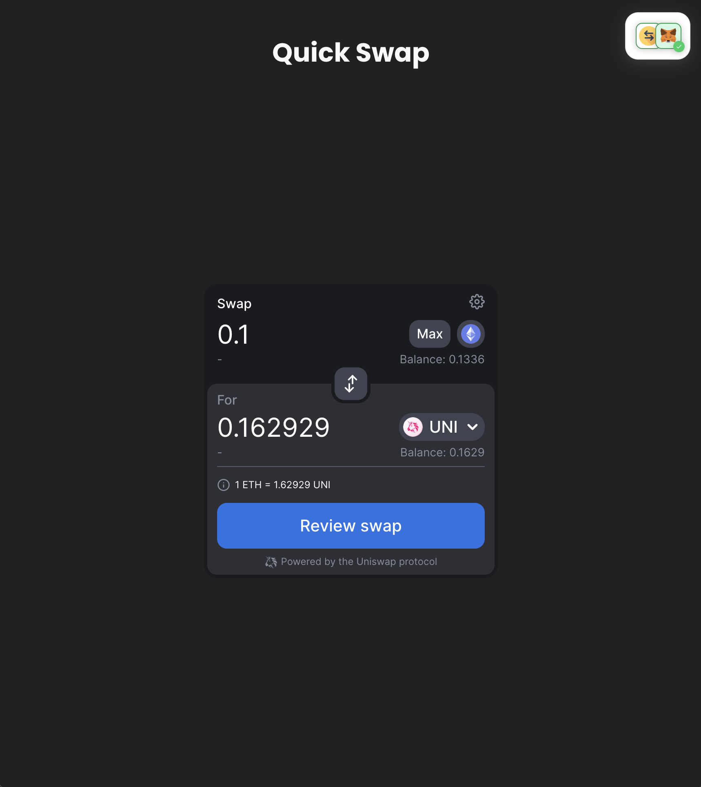
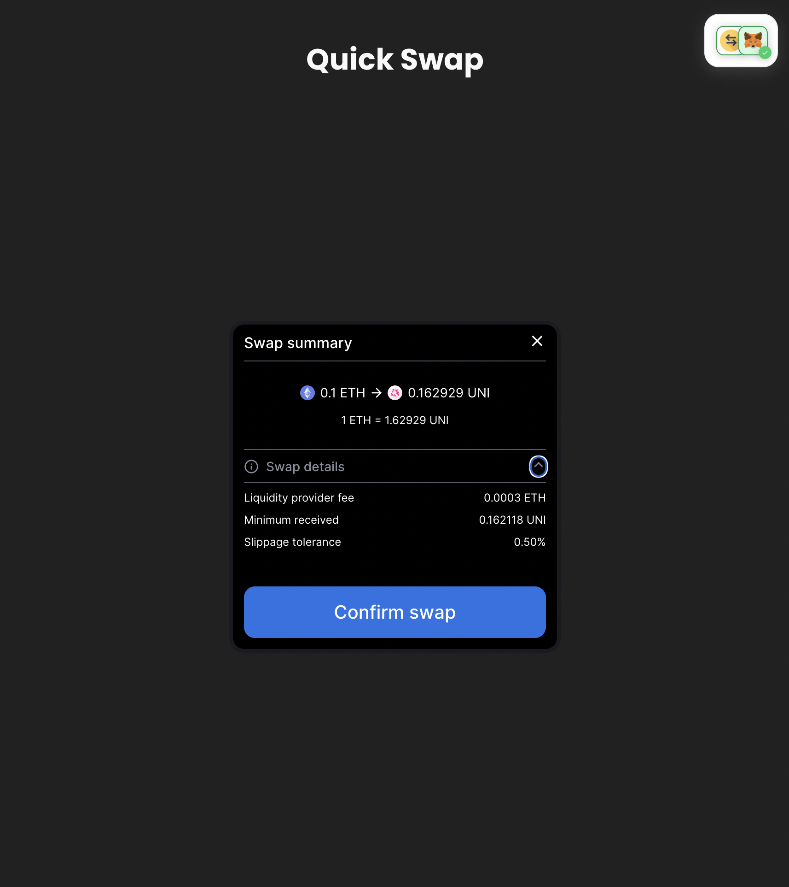
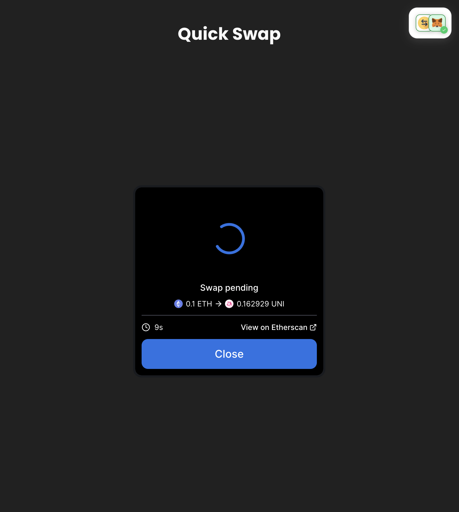
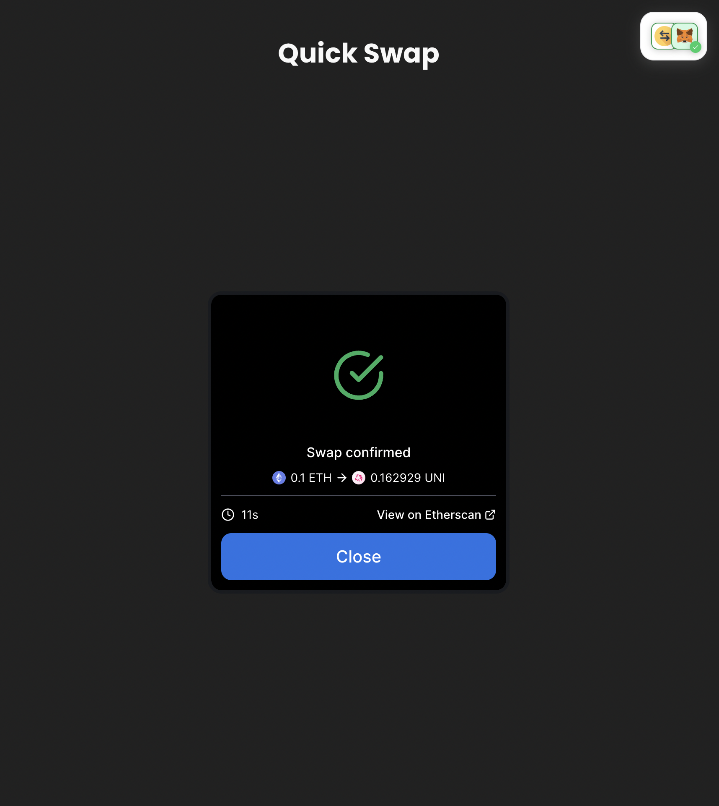

# Quick Swap

A boilerplate create-react-app DEX that utilizes Uniswap's SDK.

 

 

 

 

## Getting Started

1. Clone the repo.
1. Create `.env` file based off `.env.example`. You will also need an [Alchemy](https://www.alchemy.com/) account! 🧙‍♀️⚗️
1. Install dependencies with `yarn install` or `npm install`.
1. Run `yarn start`, the site should now be running at [localhost:3000](http://localhost:3000).
